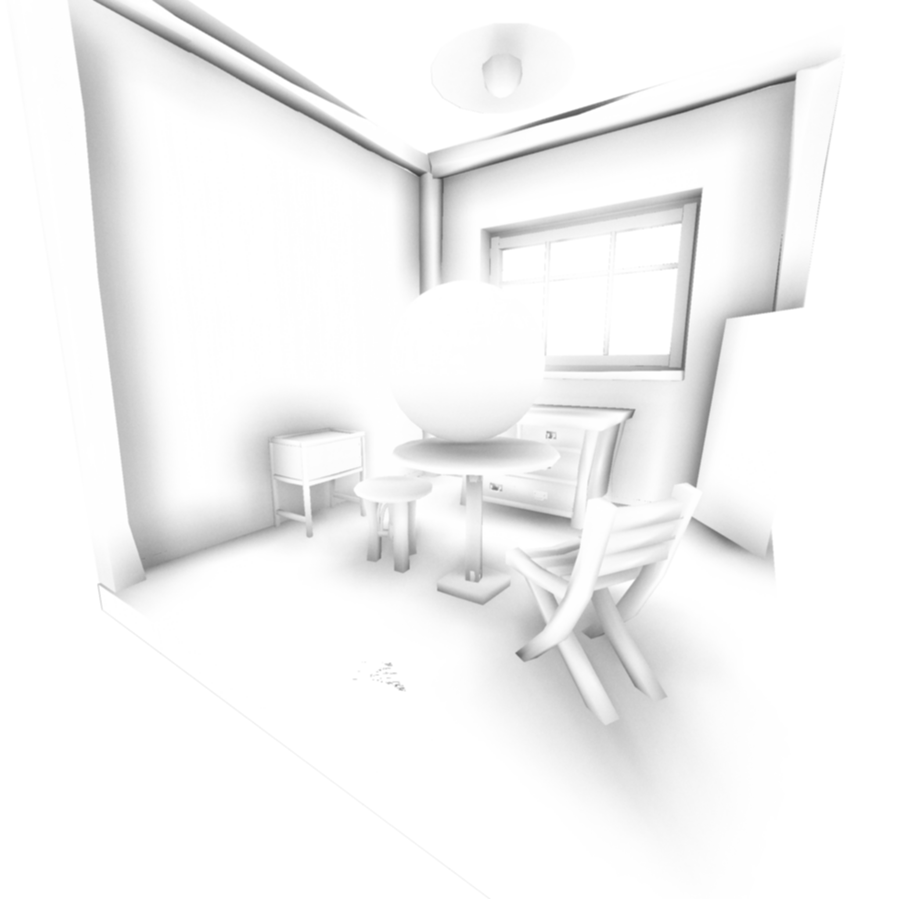
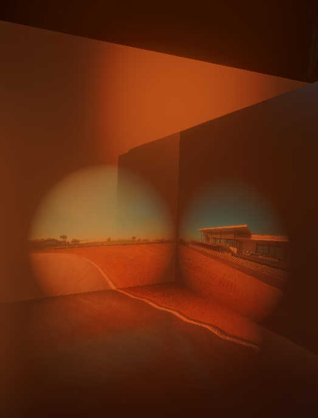
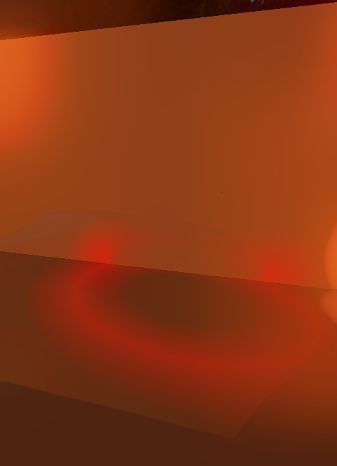
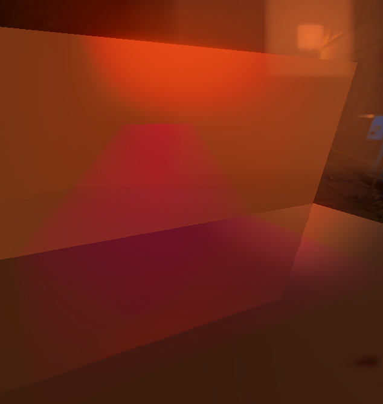

# ObjRenderer + ReguEngine

# Wiki
[Wiki Page](https://regusan.github.io/ObjRenderer/)

# DEMOs
https://github.com/user-attachments/assets/d3723aea-6997-4102-ab67-70e1ea449652

https://github.com/user-attachments/assets/4f3b877d-1ed6-4ca4-b31a-02768c429276

[](https://www.youtube.com/watch?v=J_MNxFds-0Q)

This demo is in [/src/Eaxmples/SphereGame](https://github.com/regusan/ObjRenderer/tree/main/src/Eaxmples/SphereGame). and run 
```bash
./build/Regu3D scene/SphereGame.json
```

|  |  |
| ---- | ---- |
| |  |
|  | |

# Features
- Software Rendering(C++)
- GameEngine
### Rendering Features
- Smooth Shading
- Deferred Rendering
- Image Base Lighting + HDRI BackDrop
- Tile Based Deffered Rendering
- Post Process
- Texture Sample(Albedo, Roughness, Metalic, Normal)
- Tessellation + DisplacementMap

### Engine Features
- Physics
    - Collisions
- Resource Manager
- I/O Manager

### PostProcesses
- Screen Space Ambient Occlusion(CryTek)
- Screen Space Global Illumination
- Screen Space Reflection
- Screen Space Contact Shadow
- Screen Space Global Illumination 
- Screen Space Bloom

| Effect  | Result | Buffer |
| ---- | ---- | ---- |
| Screen Space Reflection         |  |  |
| Screen Space Contact Shadow             |  |  |
| Screen Space Global Illumination        | |  |
| Screen Space Ambient Occlusion  | None | |
| Tessllation + Displacement Map  |  | |

### Lights
| Point Light  | Point Projector Light | Torus Light | Box Light |
| ---- | ---- | ---- | ---- |
|  |  |  |  |

### Rendering Pipeline


### IO
- Obj File Reading
- Image Output
- X11 Window Output
- Customizable Vertex Shader
- Customizable Pixel Shader
- Customizable Deffered lighting pass shader
- Customizable Post Process Shader
# Controls
| Common Camera Controls | Key |
| ---- | ---- |
| Camera Rotation | Mouse Movement |
| Move Forward Backward | W & S key |
| Move Right Left | D & A key |
| Move Up Down | E & Q key |

| Rendering Controls | Key |
| ---- | ---- |
| Apply Config Changes | Enter key |
| SnapShot by Cinema Mode | Space Key |
| Wire Frame Rendering Mode | 1 Key |
| Low Rendering Mode | 2 Key |
| Mid Rendering Mode | 3 Key |
| Cinema Rendering Mode | 4 Key |

| TurnTable Camera Control | Key |
| ---- | ---- |
| Cameraboom Length | Up & Down key |

# Enviroment
* Ubuntu(WSL2)
# Requirement
* make
* CMake
* g++(C++17)
* Eigen
* X11
* nlohmann-json3

# Installation
```bash
sudo apt update
sudo apt install make -y
sudo apt install g++ -y
sudo apt install cmake -y
sudo apt install libeigen3-dev -y 
sudo apt install x11-apps -y
sudo apt install libx11-dev -y
sudo apt install nlohmann-json3-dev

git clone https://github.com/regusan/ObjRenderer.git
cd ObjRenderer
```

# Usage
```bash
cmake -S . -DCMAKE_BUILD_TYPE=Release -B build
cmake --build build -j
./build/Regu3D scene/RoomScene.json
./build/Regu3D scene/SphereGame.json

#ログ表示
xterm -e watch -n 0.1 cat resource.log &

xterm -e watch -n 0.1 cat hierarchy.log &
```

# Customize
## Scene Data
Example
```json
{
    "_comment": "シーンの定義ファイル",
    "GameObjects": {
        "Mesh1": {
            "_comment": "メッシュの定義例",
            "class": "MeshActor",
            "_classExplain":"GCLASS()マクロで登録したクラス名でスポーンするクラスを指定する。",
            "args": {
            "_comment":"引数はargs内に記述する。args内はプログラム側から参照可能。",
                "position": [
                    0,
                    0,
                    0
                ],
                "rotation": [
                    0,
                    0,
                    0
                ],
                "scale": [
                    1,
                    1,
                    1
                ],
                "MeshPath": "models/room.obj"
            }
        },
        "Light0": {
            "_comment": "ポイントライトの定義例",
            "class": "SpotLightActor",
            "args": {
                "position": [
                    0,
                    10,
                    -3
                ],
                "rotation": [
                    0,
                    0,
                    -120
                ],
                "scale": [
                    1,
                    1,
                    1
                ],
                "color": [
                    3,
                    1,
                    3
                ],
                "radius": 1000,
                "angle": 10
            }
        },
        "Light1": {
            "_comment": "ランダムポイントライトの定義例",
            "class": "RandomWalkPointLightActor",
            "args": {
                "position": [
                    0,
                    3,
                    0
                ],
                "rotation": [
                    0,
                    0,
                    0
                ],
                "scale": [
                    1,
                    1,
                    1
                ],
                "color": [
                    1,
                    2,
                    1
                ],
                "radius": 5
            }
        }
    }
}
```

### Customize Actor Example
```cpp
#pragma once

#include "../Actor.hpp"
using namespace Transform;

/// @brief Actorの例
class HogeActor : public Actor
{
protected:
    Vector3f color = Vector3f(1, 0, 0);

public:
    HogeActor() {}
    /// @brief Sceneファイル読み取り時にJsonから渡される
    /// @param args
    HogeActor(json args) : Actor(args)
    {
        this->color.x() = args["color"][0];
        this->color.y() = args["color"][1];
        this->color.z() = args["color"][2];
    };
    ~HogeActor() {};
};

// GCLASSマクロでSceneファイルから生成するための登録
GCLASS(HogeActor)

```


## VertexShader & PixcelShader
1.  Define your shader
```cpp
/// @brief 頂点シェーダーの例
/// @param in 入力データ格納構造体
/// @return 出力データ格納構造体
inline const VertOutputStandard YourOwnVertShader(const VertInputStandard &in)
{
  //Write own vertex transform 
}

/// @brief ピクセルシェーダーの例
/// @param in 入力データ格納構造体
/// @return 出力データ格納構造体
inline const PixcelOutputStandard YourOwnPixcelShader(const PixcelInputStandard &in)
{
  //Write own pixcel shader
}
```
2. Run geometry pass
```cpp
RenderingPipeline::Deffered::ExecGeometryPass(model, in, gb, YourOwnVertShader, YourOwnPixcelShader);
```

## Second Pass(Deffered Lighting Pass)
1.  Define your light pass shader
```cpp
/// @brief ライトパスシェーダー
/// @param gbuffers
/// @param environment
/// @param x
/// @param y
/// @return 該当ピクセルの色
inline const Vector3f YourOwnLightPassShader(GBuffers &gbuffers, RenderingEnvironmentParameters &environment, int x, int y)
{
  //define your light pass shader
  return color;
}
```
2. Set lighting pass argment
```cpp
RenderingPass::ExecLightingPass(gb, YourOwnLightPassShader, in.environment);
```

# Preparing 3D model
Blender Export settings


# Credit
External Libraries
Using there libraries
| Name | Usage | License |
| ---- | ---- | ---- |
| [stb_image.h](https://github.com/nothings/stb) | Image Loader | Public Domain |
| [stb_image_write.h](https://github.com/nothings/stb) | Output Rendering Result | Public Domain |
| [nlohmann-json3](https://github.com/nlohmann/json) | Json Parser |  MIT |
| [Eigen](https://eigen.tuxfamily.org/) | Linear Algebra | MPL2.0 | 

# License
## Main License
This is under [MIT license](https://en.wikipedia.org/wiki/MIT_License).

[self link](https://github.com/regusan/ObjRenderer.git)
